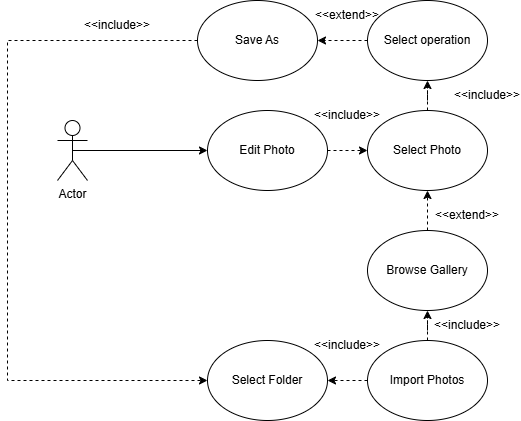

# SRS — Software Requirements Specification

**Project:** [Photo Manager Application]  
**Author:** [Artem Legeida]  
**Date:** [Date]

---

## 1. Introduction and Purpose

Build a fast Windows application for **browsing, organizing, and editing photos**. The UI must be clean and modern so non‑technical users can use it immediately.

> What problem does the software solve and who will use it?

---

## 2. Scope of the System

The system is a Windows-based photo management and editing application designed to run without complex installation (portable EXE or simple installer). It allows users to import photos from local folders or external drives, supporting formats such as .jpg, .png, .tiff, paired RAW, and .heic. Users can browse albums, open individual photos, perform basic edits (crop, rotate, adjust brightness, contrast, and sharpness), and export results in common formats (.jpg, .png, .tiff). The system supports adding customizable watermarks or logos, editing both single images and groups of selected photos, and organizing content through tagging, rating, commenting, and categorizing. Advanced search and filtering by date, tag, or rating are included, along with auto-save functionality to prevent data loss and progress bars for long operations to ensure responsiveness. The app is optimized to handle large libraries (up to 10,000 photos) efficiently without excessive memory usage. Developers are required to provide weekly progress updates to the customer. Out of scope for this version are advanced photo manipulation features such as layers, AI-based enhancements, cloud synchronization, and online sharing — these may be considered for future releases.

---

## 3. Functional Requirements

This section describes the main system functions grouped by purpose: photo management, editing, export, user interaction, and performance.

### 3.1 Photo Management

- FR-1.1: The user can import photos from local folders and external drives.
- FR-1.2: The application must be able to display all photos in supported formats located in the selected folder, including its subfolders.
- FR-1.3: The system supports the following formats: `.jpg`, `.jpeg`,`.png`, `.tiff`, `.gif`, and `.bmp`.
- FR-1.4: Imported photos are displayed in albums or gallery view.
- FR-1.5: The number of displayed thumbnails must be adapted to the size of the display window in which the gallery is shown.
- FR-1.6: The user can open a single photo from the gallery.
- FR-1.7: Each photo can be displayed in its original resolution after being selected from the gallery. If the photo is larger than the display window, the user must have the option to scroll within the window to view the entire image.
- FR-1.8: The user can tag, rate, and comment on individual photos.
- FR-1.9: For each photo, it must be possible to add one tag and one rating (1–5). If no rating is provided, the photo is considered unrated.
- FR-1.10: The user can search and filter photos by date, tag or rating.
- FR-1.11: The system can load and display large libraries (up to 10,000 photos) without excessive memory usage.

### 3.2 Photo Editing

- FR-2.1: The user can perform basic edits, including crop, rotate, brightness, contrast, and sharpness adjustments.
- FR-2.2: It must be possible to apply predefined filters: grayscale (monochromatic), sepia, negative, pastel effect, and vintage.
- FR-2.3: The user can apply edits to a single image or a group of selected images.
- FR-2.4: The user can add a watermark or logo with adjustable position (corner selection) and transparency.
- FR-2.5: The user can specify the watermark image.
- FR-2.6: Each photo, either after editing or without any modifications, can be exported to `.jpg`, `.jpeg`,`.png`, `.tiff` and `.bmp` formats.

### 3.3 User Interface and Interaction

- FR-3.1: The user interface (UI) must be clear and unambiguously described.
- FR-3.2: The system includes a progress bar for long-running operations (e.g., batch processing, large imports).
- FR-3.3: The app must start easily on Windows (portable EXE or simple installer).
- FR-3.4: The system provides an auto-save mechanism to prevent loss of edits after crashes.
- FR-3.5: Developers must provide weekly progress updates to the customer (internal reporting).

## 4. Non-Functional Requirements (NFR)

| Category        | ID    | Description                                                                                                 |
| --------------- | ----- | ----------------------------------------------------------------------------------------------------------- |
| **Performance** | NFR-1 | Load 10000 photos within 10 seconds after opening the catalog.                                              |
| **Persistence** | NFR-2 | Tag and rating are saved locally and restored correctly after restarting the application (across sessions). |
| **Usability**   | NFR-3 | Basic edit operation can be performed in max. 14 clicks.                                                    |
| **Portability** | NFR-4 | Works on Windows.                                                                                           |
| **Security**    | NFR-5 | Local data are stored privately and never shared.                                                           |

---

## 5. Actors and Use-Cases

### 5.1 Actors

| Actor                    | Description                                                                                                                         |
| ------------------------ | ----------------------------------------------------------------------------------------------------------------------------------- |
| **User**                 | The primary actor who interacts with the application — imports, organizes, edits, rates, and exports photos.                        |
| **File System**          | Provides access to local folders, external drives, and photo files used for import and export operations.                           |
| **Developer**            | Maintains the system, monitors performance, and provides weekly progress reports to the customer.                                   |
| **Application (System)** | Executes all operations requested by the user, such as displaying galleries, processing edits, managing tags, and auto-saving data. |

### 5.2 Use-Cases

| ID   | Name                | Description                                                                                              |
| ---- | ------------------- | -------------------------------------------------------------------------------------------------------- |
| UC-1 | Import Photos       | The user selects a folder and the app loads all photos.                                                  |
| UC-2 | Browse Gallery      | The user views albums or photo grids and opens a single photo for detailed viewing.                      |
| UC-3 | Edit Photo          | The user performs basic edits (crop, rotate, brightness, contrast, sharpness) on one or multiple photos. |
| UC-4 | Add Watermark       | The user adds a logo or watermark, adjusting its position and transparency.                              |
| UC-5 | Tag and Rate Photos | The user adds tags, comments, and ratings to photos .                                                    |
| UC-6 | Search and Filter   | The user searches and filters photos by date, tag, rating, or category.                                  |
| UC-7 | Export Photos       | The user exports one or more edited photos in `.jpg`, `.png`, or `.tiff` formats.                        |
| UC-8 | Manage Categories   | The user creates, edits, and organizes custom photo categories.                                          |

## 5.3 Use-Case Diagram

---

## 6. System Constraints

> Describe project limitations, technologies, or standards that must be followed.

- SC-1: Programming language and framework: C++ / Qt.
- SC-2: Use only open-source libraries (open-source version of Qt).
- SC-3: Works fully offline.
- SC-4: Maximum file size: 100 MB per photo.
- SC-5: Maximum supported library size: 15,000 photos.

---

## 7. Assumptions and Dependencies

- A-1: The user has SDD and at least 8 GB RAM.
- A-2: The application has access to the file system (disk, USB).
- A-3: Third-party libraries will be available and compatible with Qt and MVS 2022

---

## 8. Out of Scope

- AI categorization
- Cloud synchronization or online sharing features.
- Mobile version of application

## 9. Open Questions

> List unclear points or missing information you still need to confirm.

- Q1: Should edits overwrite the original file or save a copy?

---
